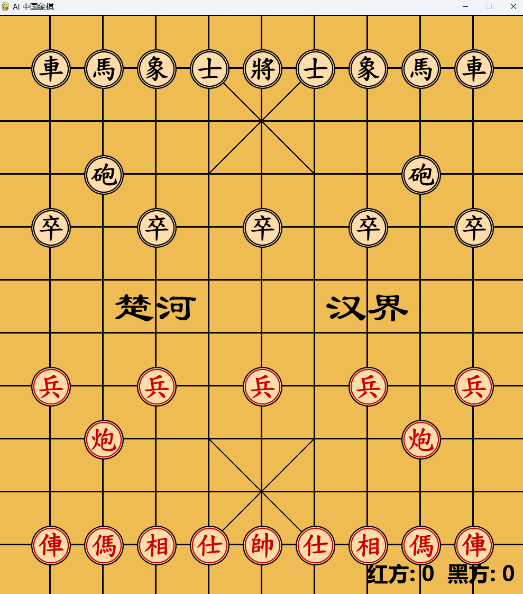

# AI Chess Game 🎮🤖
### [GitHub 仓库](https://github.com/nitsc/AI-Chess-Game)

这是一款支持与本地 **DeepSeek R1:14B** 和 API **ChatGLM4-PLUS** 对弈的象棋游戏。游戏提供图形界面、多种玩法和内置音效，带来绝佳的 AI 对弈体验！😊enjoy！

小注: 语言模型可能会回复错误, 请不要频繁使用甚至尝试窃取我的 key.  我无法找到更多免费的 API Key 了(OpenAI 可能不错，但是我没有信用卡). 分数在 pygame 可能刷新不出来, 请看命令行. 辛苦写了很久的项目, 希望能给高分, 谢谢! 🙏🙏🙏🙇🙇🙇‍

## 功能概览 📝

- **AI 对弈**：支持 DeepSeek R1:14B 与 ChatGLM4-PLUS 对弈 🤖
- **图形界面**：通过 `gui.py` 提供简洁易用的界面 🎨
- **精美棋盘和棋子图片**：丰富视觉体验 🎲
- **内置音效**：背景音乐增添乐趣 🎵

## 环境要求 📦

- Python 3.11 及以上版本 🐍
- PyCharm 专业版 (社区版应该也行，最好从 PyCharm 运行，否则可能会出现找不到模块 src 的问题)
- 所需 Python 库 (使用 `requirements.txt` 安装）

## 安装与使用

### Windows 🪟

1. **安装依赖**  
   确保安装 Python 3.11+ 后，执行：
   ```bash
   pip install -r requirements.txt
   ```

2. **运行游戏**  
   进入 `src` 文件夹，执行：👍
   ```bash
   python src/main.py
   ```

## Ollama 上的 DeepSeek R1 14B 🐑
如果你想使用 Ollama 模型 (不仅限 DeepSeek R1 14B, 可修改 logic.py 的 AI 类实现) 
1. 前往 [OLLAMA](https://ollama.com/)  下载并安装 Ollama 可执行文件 📥
2. 启动 Ollama 服务 💻
   ```bash
   ollama serve
   ```
3. 拉取 DeepSeek R1 14B 模型 (请根据需求修改 logic.py 和 命令)  🚚
   ```bash
   ollama pull deepseek-r1:14b
   ```
4. 运行游戏 🎮
5. 输入选项 2 🔢

运行后，通过 PyGame 窗口即可与 AI 开始精彩对弈！😊😊😊

## 许可证

本项目采用 GNU General Public License v3.0 许可证，详情请参阅 LICENSE 文件 📄
